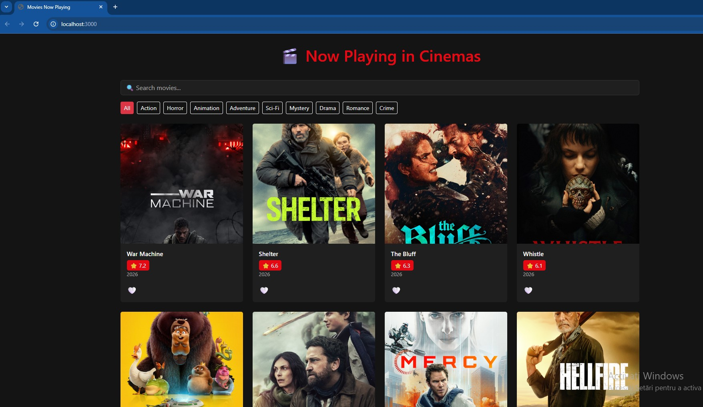
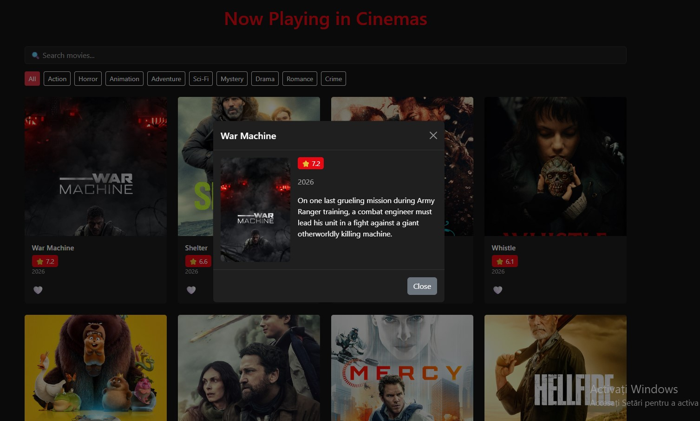
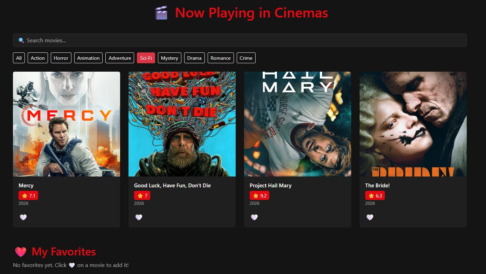
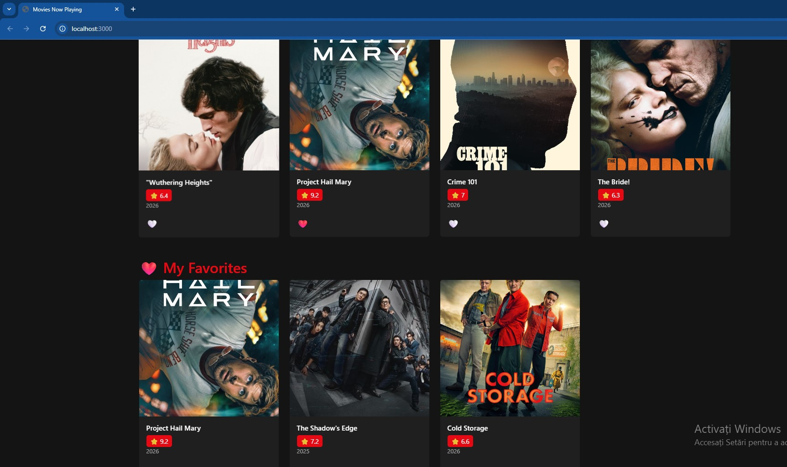

# Movie Web App

A full-stack web application that displays movies currently playing in cinemas, built with Node.js, Express, and SQL Server.

## Screenshots

### Home Page - Movie Grid

Movies currently playing in cinemas, fetched automatically from TMDB API and displayed in a responsive grid.

### Movie Details 

Click on any movie to see title, rating, release year and description.

### Genre Filtering

Filter movies by genre using the category buttons. Active genre is highlighted in red.

### Favorites Section

Add movies to favorites by clicking the heart icon. Favorites are saved per user in the database.
## Features

- Fetches real-time movies from TMDB API
- Search movies by title
- Filter movies by genre
- Click on a movie to see details
- Add/remove movies to favorites
- Favorites saved per user in database

## Technologies

- **Frontend:** HTML, CSS, JavaScript, Bootstrap 5
- **Backend:** Node.js, Express.js
- **Database:** SQL Server (SSMS)
- **API:** TMDB (The Movie Database)

## How to Run

1. Clone the repository
2. Install dependencies:
```bash
npm install
```
3. Create a `.env` file based on `ex.env`:
```
TMDB_API_KEY=your_key_here
DB_SERVER=your_server
DB_NAME=MovieApp
DB_USER=your_user
DB_PASSWORD=your_password
PORT=3000
```
4. Run the app:
```bash
node server.js
```
5. Open `http://localhost:3000`

## Project Structure

| Branch | Description |
|--------|-------------|
| `database` | SQL and database diagram |
| `backend` | Node.js server, API endpoints |
| `frontend` | HTML, CSS, JavaScript UI |

## API Used

- [TMDB API](https://www.themoviedb.org/documentation/api)
